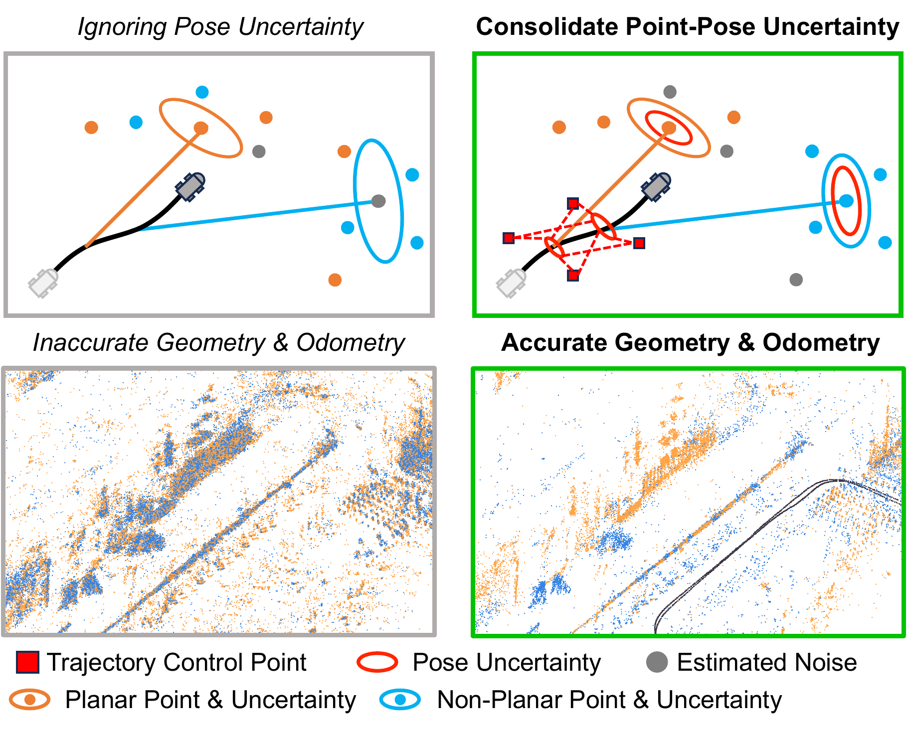
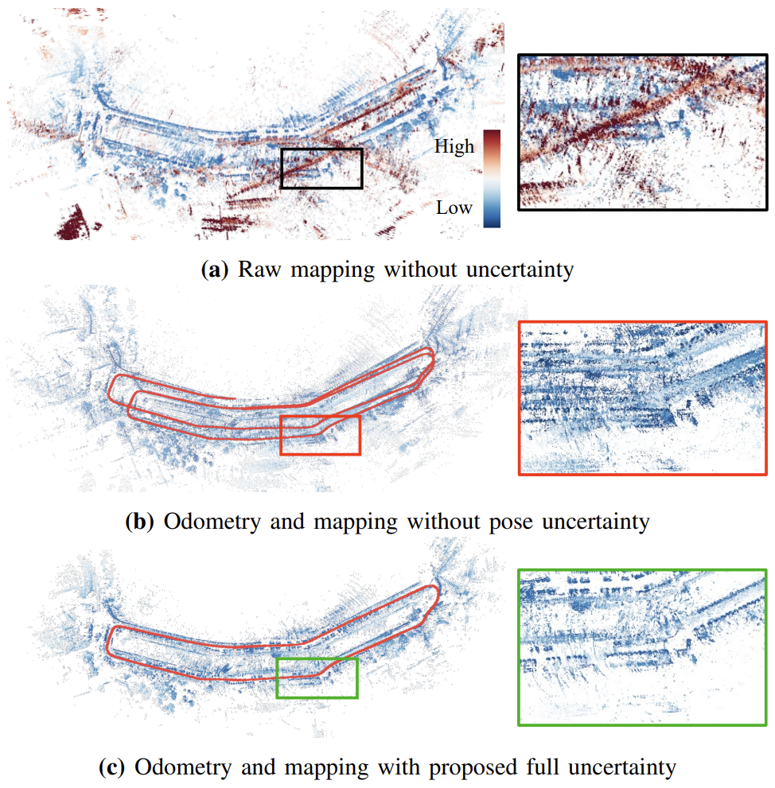

<p align="center">
  <h1 align="center">GeoRIO: Geometrically-Constrained Radar-Inertial Odometry via Continuous Point-Pose Uncertainty Modeling</h1>
  <p align="center"><a href="https://arxiv.org/abs/2604.02745">Arxiv</a> | <a href="https://ieeexplore.ieee.org/document/11455624">IEEE RA-L</a></p>
  </p> <p align="center">
    <a href="https://scholar.google.com/citations?hl=en&user=lh2KUKMAAAAJ"><strong>Wooseong Yang</strong></a>
    ·
    <a href="https://scholar.google.com/citations?hl=en&user=t_5U_98AAAAJ"><strong>Dongjae Lee</strong></a>
    ·
    <a href="https://scholar.google.com/citations?hl=en&user=aKPTi7gAAAAJ"><strong>Minwoo Jung</strong></a>
    ·
    <a href="https://scholar.google.com/citations?hl=en&user=7yveufgAAAAJ"><strong>Ayoung Kim</strong></a>
  </p>
  <div align="center"></div>
</p>

<p align="center">
  
</p>

## TL;DR

GeoRIO is a 4D radar–inertial odometry and mapping system that addresses unreliable map geometry when sparse, noisy scans are accumulated. Using a continuous-time trajectory, it jointly propagates measurement and pose uncertainty into the map frame to quantify each radar point’s reliability. This uncertainty is used to down-weight unreliable observations and replace uncertain map points with more reliable measurements. The resulting uncertainty-aware map enables effective point-to-plane registration and localizability-constrained state updates for accurate radar odometry.

<p align="center">
  
</p>
<p align="center">
  <em> Mapping result in Library sequence. Jointly consolidating point-pose uncertainty removes the ghosted double walls.</em>
</p>

## How to run

### 1. Git clone

```bash
cd <your directory>
git clone --recurse-submodules https://github.com/wooseongY/GeoRIO.git src
cd src
```

### 2. Docker Build

```bash
cd <your directory>/src
chmod +x ./docker/build_georio.sh ./docker/run_georio.sh
./docker/build_georio.sh
```

### 3. Docker run

```bash
cd <your directory>/src
./docker/run_georio.sh

```
`run_georio.sh` mounts:
- `<your directory> -> /root/ros2_ws`
- `<data directory> -> /root/data`

To override dataset path:

```bash
cd <your directory>/src
DATA_ROOT=/path/to/your/data ./docker/run_georio.sh
```

To override workspace root:

```bash
cd <your directory>/src
WORKSPACE_ROOT=/path/to/ros2_ws DATA_ROOT=/path/to/your/data ./docker/run_georio.sh
```

### 4. Build georio

Inside the container:

```bash
source /opt/ros/humble/setup.bash
cd /root/ros2_ws
rm -rf build install log
colcon build --packages-up-to geo_rio
source install/setup.bash
```

### 5. Launch

Inside the same container. Each launch file starts the node with one config and RViz:

```bash
ros2 launch geo_rio snail_radar.launch.py      # SNAIL-Radar, 4D radar + IMU
ros2 launch geo_rio hercules_radar.launch.py   # HeRCULES, 4D radar + IMU
ros2 launch geo_rio hkust_seq.launch.py        # HKUST, 4D radar + IMU
```

Then play the data in another terminal, e.g. `ros2 bag play <bag_dir>`. To run a different
sequence, point the launch file at that sequence's config in `geo_rio/config/`.

### 6. Deterministic replay (recommended for evaluation)

With live playback the filter batches whatever measurements arrived while the previous update was
running, so the result depends on CPU speed and scheduling and two runs of the same configuration
can differ substantially. For evaluation, let the node read the recording itself: it runs
single-threaded with no executor and no bag-player clock, two runs are byte-identical, and a
sequence replays in a fraction of real time.

```bash
# SNAIL-Radar and HKUST: a ROS 2 bag directory
ros2 run geo_rio GEORIO --ros-args \
    --params-file install/geo_rio/share/geo_rio/config/config_snail_20240113_1.yaml \
    -p offline_bag:=/root/data/snail/20240113/data1

# HeRCULES: the dataset's raw sequence folder, read directly
ros2 run geo_rio GEORIO --ros-args \
    --params-file install/geo_rio/share/geo_rio/config/config_hercules_library.yaml \
    -p offline_hercules_dir:=/root/data/hercules/raw_data/Library/01
```

Each config writes its trajectory to the `result_file_path` it declares, in TUM format
(`timestamp tx ty tz qx qy qz qw`), ready for `evo` or any TUM-compatible tool.

## Citation

If you use our paper for any academic work, please cite our paper.

```bibtex
@ARTICLE {wsyang-2026-ral,
    AUTHOR = { Wooseong Yang and Dongjae Lee and Minwoo Jung and Ayoung Kim },
    JOURNAL = { IEEE Robotics and Automation Letters (RA-L) },
    TITLE = { Geometrically-Constrained Radar-Inertial Odometry via Continuous Point-Pose Uncertainty Modeling },
    YEAR = { 2026 },
    VOLUME = { 11 },
    NUMBER = { 5 },
    PAGES = { 6098-6105 },
}
```

## Contact

If you have any questions, please contact:
- Wooseong Yang (Email: wseongy15@gmail.com)

## Credits

Our code is based on [RESPLE](https://github.com/asig-x/RESPLE).
